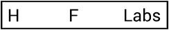
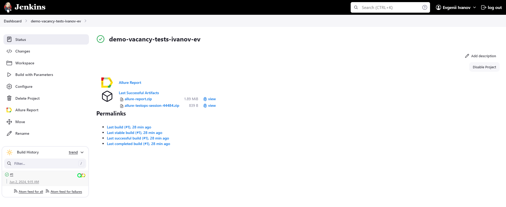
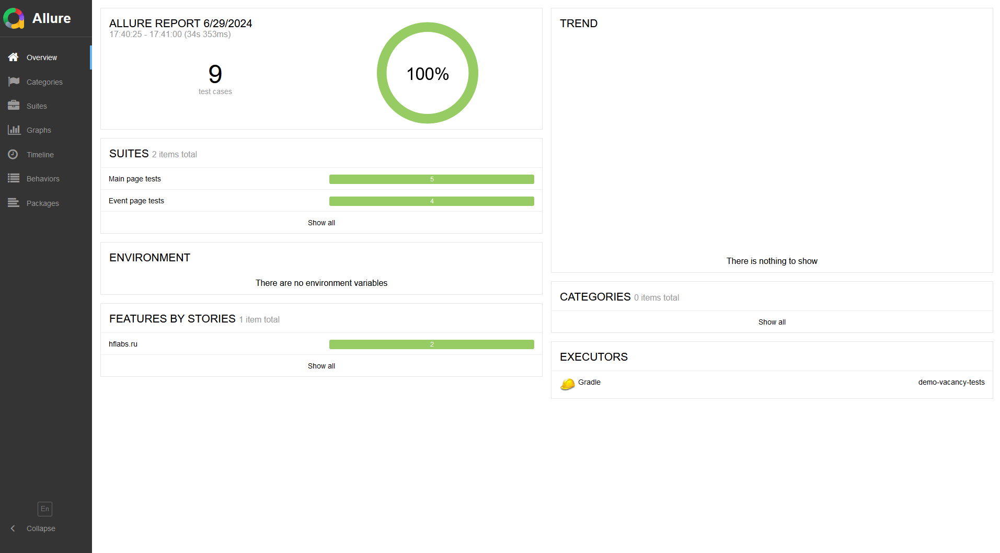
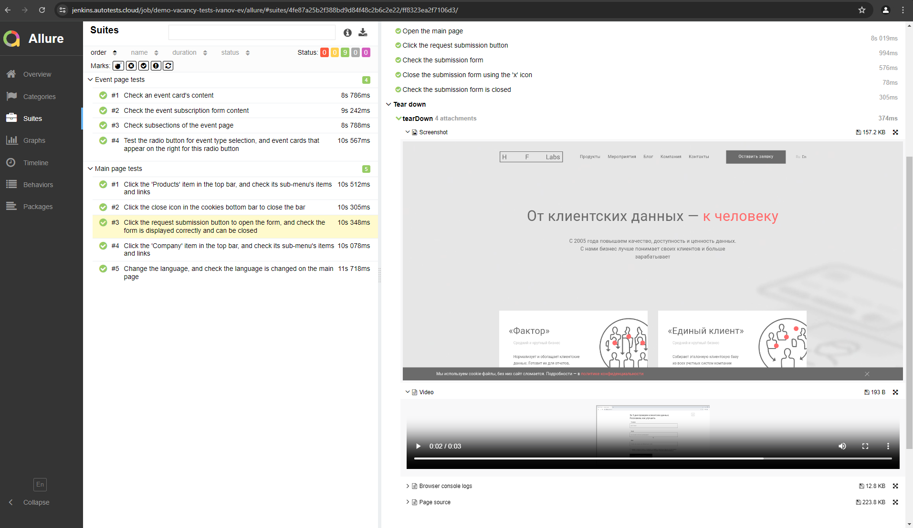
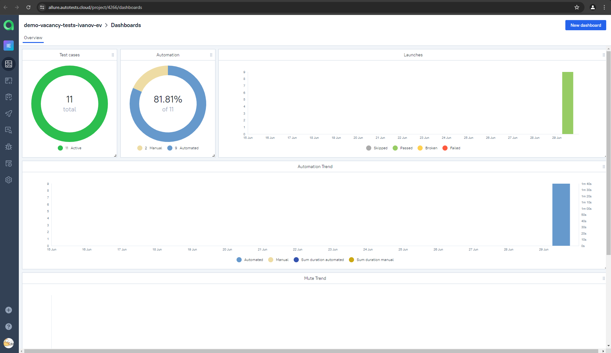
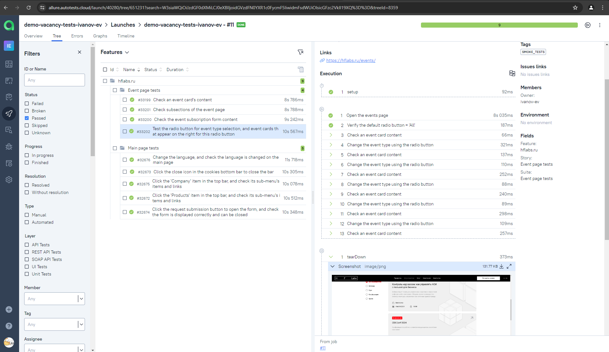
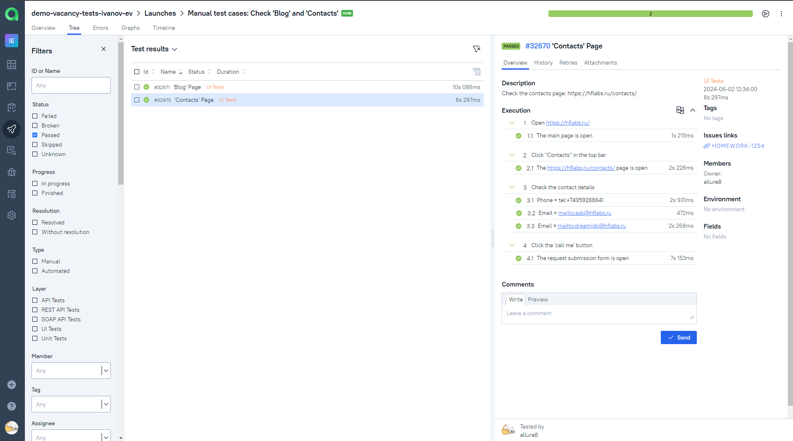
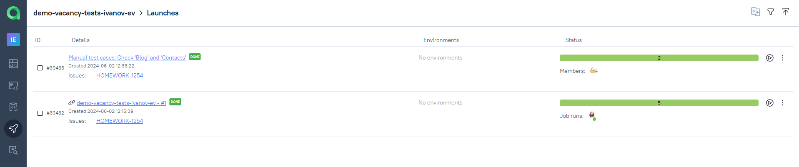
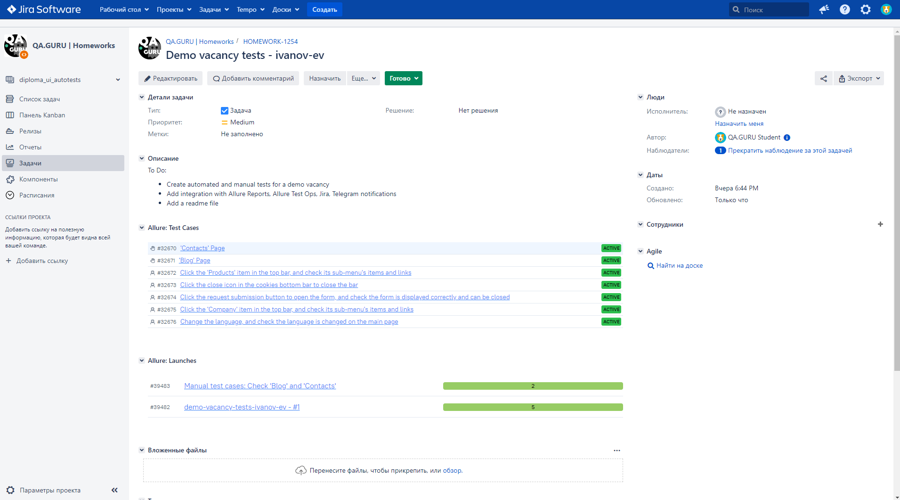
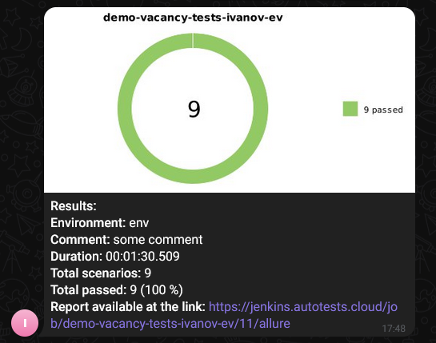

# Sample Test Automation Project in Java for the [HFLABS.RU](https://hflabs.ru/) Website

---

HFLabs provides customer data quality and data integration solutions and services in Russia. Founded in 2005.

<a href="hhttps://hflabs.ru/"></a>

---

## Contents:

- <a href="#tools">Tools and Technologies</a>
- <a href="#scenarios">Test Scenarios</a>
- <a href="#jenkins">CI/CD with Jenkins</a>
- <a href="#cli">Launch from the CLI</a>
- <a href="#allure">Allure Reports</a>
- <a href="#allure-testops">Integration with Allure TestOps</a>
- <a href="#jira">Integration with JIRA</a>
- <a href="#telegram">Telegram Bot Notifications</a>
- <a href="#video">Test Execution Example</a>

---

<a id="tools"></a>
## Tools and Technologies:

| Java                                                                                                       | IntelliJ  <br>  Idea | GitHub | JUnit 5 | Gradle | Selenide | Selenoid | Allure <br> Report | Jenkins | Jira                                                                                                                              | Telegram | Allure <br> TestOps                                                                                                     |
|------------------------------------------------------------------------------------------------------------|----------------------|--------|---------|--------|----------|----------|--------------------|---------|-----------------------------------------------------------------------------------------------------------------------------------|----------|-------------------------------------------------------------------------------------------------------------------------|
| <a href="https://www.java.com/"></a> | <a href="https://www.jetbrains.com/idea/"></a> | <a href="https://github.com/"></a> | <a href="https://junit.org/junit5/"></a> | <a href="https://gradle.org/"></a> | <a href="https://selenide.org/"></a> | <a href="https://aerokube.com/selenoid/"></a> | <a href="https://github.com/allure-framework/allure2"></a> | <a href="https://www.jenkins.io/"></a> | <a href="https://www.atlassian.com/ru/software/jira/"></a> | <a href="https://telegram.org/"></a> | <a href="https://qameta.io/"></a> |

---

<a id="scenarios"></a>
## Test Scenarios
* [x] Click the close icon in the cookies bottom bar to close the bar (Automated)
* [x] Click the request submission button to open the form, and check the form is displayed correctly and can be closed (Automated)
* [x] Change the language, and check the language is changed on the main page (Automated)
* [x] Click the 'Products' item in the top bar, and check its sub-menu's items and links (Automated)
* [x] Click the 'Company' item in the top bar, and check its sub-menu's items and links (Automated)
* [x] Check the blog page: https://blog.hflabs.ru/ (Manual)
* [x] Check the contacts page: https://hflabs.ru/contacts/ (Manual)

---

<a id="jenkins"></a>
## </a><a name="CI/CD with Jenkins"></a>CI/CD with [Jenkins](https://jenkins.autotests.cloud/job/demo-vacancy-tests-ivanov-ev/)</a>



### Jenkins parameters:

- `BROWSER` (a web-browser, `chrome` by default)
- `BROWSERVERSION` (a browser version)
- `BROWSERSIZE` (a browser window size)
- `REMOTE` (a remote Selenoid server)

---

<a id="cli"></a>
## Launch from the CLI

**Local:**
```bash  
./gradle clean smoke_tests
```

**Remote launch in Jenkins:**
```bash  
clean smoke_tests -Dselenide.browser=${BROWSER} -Dselenide.browserVersion=${BROWSERVERSION} -Dselenide.browserSize=${BROWSERSIZE} -Dselenide.remote=${REMOTE}
```
---

<a id="allure"></a>
## </a> <a name="Allure"></a>[Allure Reports](https://jenkins.autotests.cloud/job/demo-vacancy-tests-ivanov-ev/allure/)</a>

`Allure report` includes:
- Test steps
- Screenshot of the page
- Page source
- Browser console logs
- Video recording

 



---


<a id="allure-testops"></a>
## </a> Integration with <a target="_blank" href="https://allure.autotests.cloud/project/4266/dashboards">Allure TestOps</a>

Test cases and test execution history are available in `Allure TestOps`. 

The dashboard displays test run statistics:



Automated test cases:



Manual test cases:



Launches:



---

<a id="jira"></a>
## </a> Integration with <a target="_blank" href="https://jira.autotests.cloud/browse/HOMEWORK-1254">Jira</a>

There is a task in `Jira` that contains references to Allure test cases and Allure launches:



---

<a id="telegram"></a>
## </a> Telegram Bot Notifications
After every launch, the Telegram bot sends a notification with an `Allure report`:

 

---

<a id="video"></a>
## </a> Test Execution Example

<img alt="Video" src="./images/screenshots/TestExecutionExample.gif"
